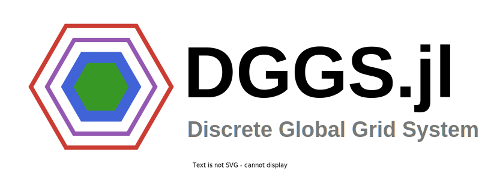

# DGGS.jl 

[](https://dloos.github.io/DGGS.jl/stable/)
[](https://dloos.github.io/DGGS.jl/dev/)
[](https://github.com/dloos/DGGS.jl/actions/workflows/CI.yml?query=branch%3Amain)
[](https://codecov.io/gh/dloos/DGGS.jl)

DGGS.jl is a Julia Package for scalable geospatial analysis using Discrete Global Grid Systems (DGGS), which tessellate the surface of the earth with hierarchical cells of equal area, minimizing distortion and loading time of large geospatial datasets, which is crucial in spatial statistics and building Machine Learning models.

## Get Started

This package can be installed in Julia with the following commands:

```Julia
using Pkg
Pkg.add("DGGS")
```

## Development

This project is based on [dggrid-julia](https://github.com/danlooo/dggrid-julia) to provide julia bindings for the C++ library [DGGRID](https://github.com/sahrk/DGGRID).
