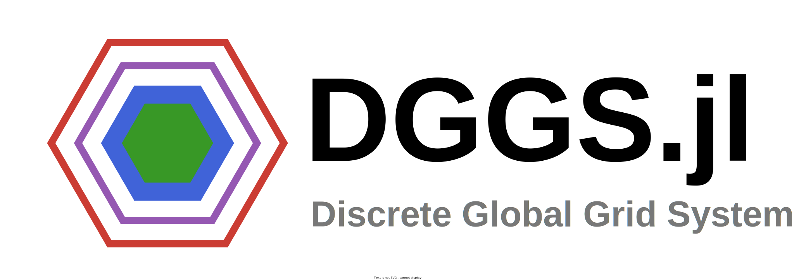

# DGGS.jl 

[](https://danlooo.github.io/DGGS.jl/stable/)
[](https://danlooo.github.io/DGGS.jl/dev/)
[](https://github.com/danlooo/DGGS.jl/actions/workflows/CI.yml?query=branch%3Amain)
[](https://codecov.io/gh/danlooo/DGGS.jl)

DGGS.jl is a Julia Package for scalable geospatial analysis using Discrete Global Grid Systems (DGGS), which tessellate the surface of the earth with hierarchical cells of equal area, minimizing distortion and loading time of large geospatial datasets, which is crucial in spatial statistics and building Machine Learning models.

## Get Started

This package can be installed in Julia with the following commands:

```Julia
using Pkg
Pkg.add(url="https://github.com/danlooo/DGGS.jl.git")
```

Create a simple grid:

```julia
using DGGS
grid = create_toy_grid()
# DGGS Grid with HEXAGON topology, ISEA projection, apterture of 4, and 642 cells
```

Convert between cell id and geographic coordinates:

```
get_cell_name(grid, 80, -170)
# 483
get_geo_coords(grid, 483)
```

## Development

This project is based on [DGGRID](https://github.com/sahrk/DGGRID).