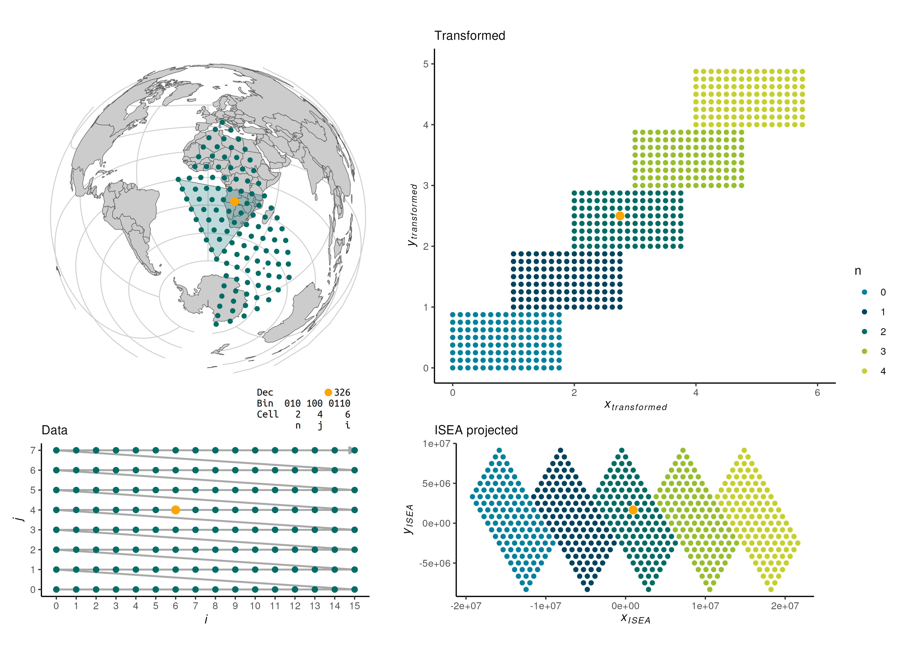

# DGGS.jl 

[](https://danlooo.github.io/DGGS.jl/stable/)
[](https://danlooo.github.io/DGGS.jl/dev/)
[](https://github.com/danlooo/DGGS.jl/actions/workflows/CI.yml?query=branch%3Amain)
[](https://codecov.io/gh/danlooo/DGGS.jl)

DGGS.jl is a Julia Package for scalable geospatial analysis using Discrete Global Grid Systems (DGGS), which tessellate the surface of the earth with hierarchical cells of equal area, minimizing distortion and loading time of large geospatial datasets, which is crucial in spatial statistics and building Machine Learning models.

> [!WARNING]  
> This package is still in its early development.

## Get Started

Install:

```julia
using Pkg
Pkg.add(url="https://github.com/danlooo/DGGS.jl.git")
```

Convert coordinates:

```julia
using DGGS

to_cell(120.8, -80, 8) |> to_geo
```

## Background

1. Snyder Equal Area Projection
1. Rectify diamonds: Rotation and skew
1. Storage into 5 matrices



Lastly, the coordinates are subdivided into 5 rectangular matrices, i.e. a PentaCube.

## Funding

<p>
<a href = "https://earthmonitor.org/">

</a>

<a href = "https://earthmonitor.org/">

</a>
</p>

This project has received funding from the [Open-Earth-Monitor Cyberinfrastructure](https://earthmonitor.org/) project that is part of European Union's Horizon Europe research and innovation programme under grant [101059548](https://cordis.europa.eu/project/id/101059548).
