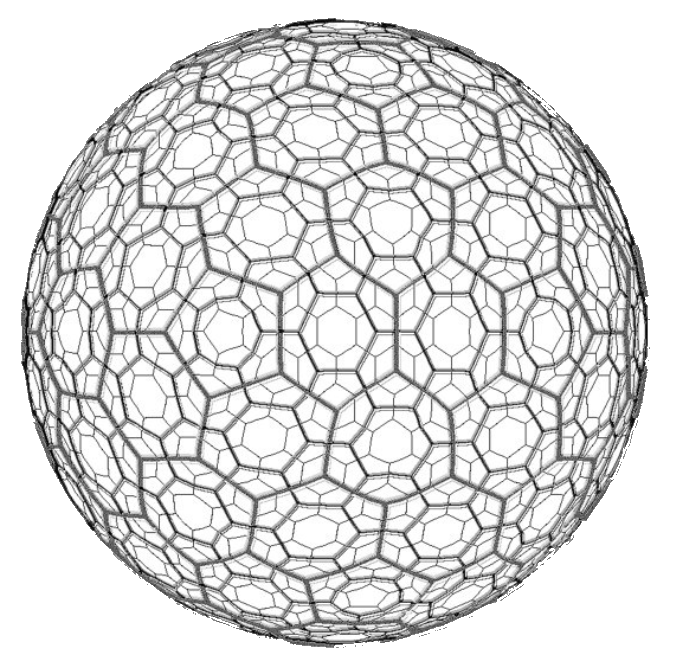
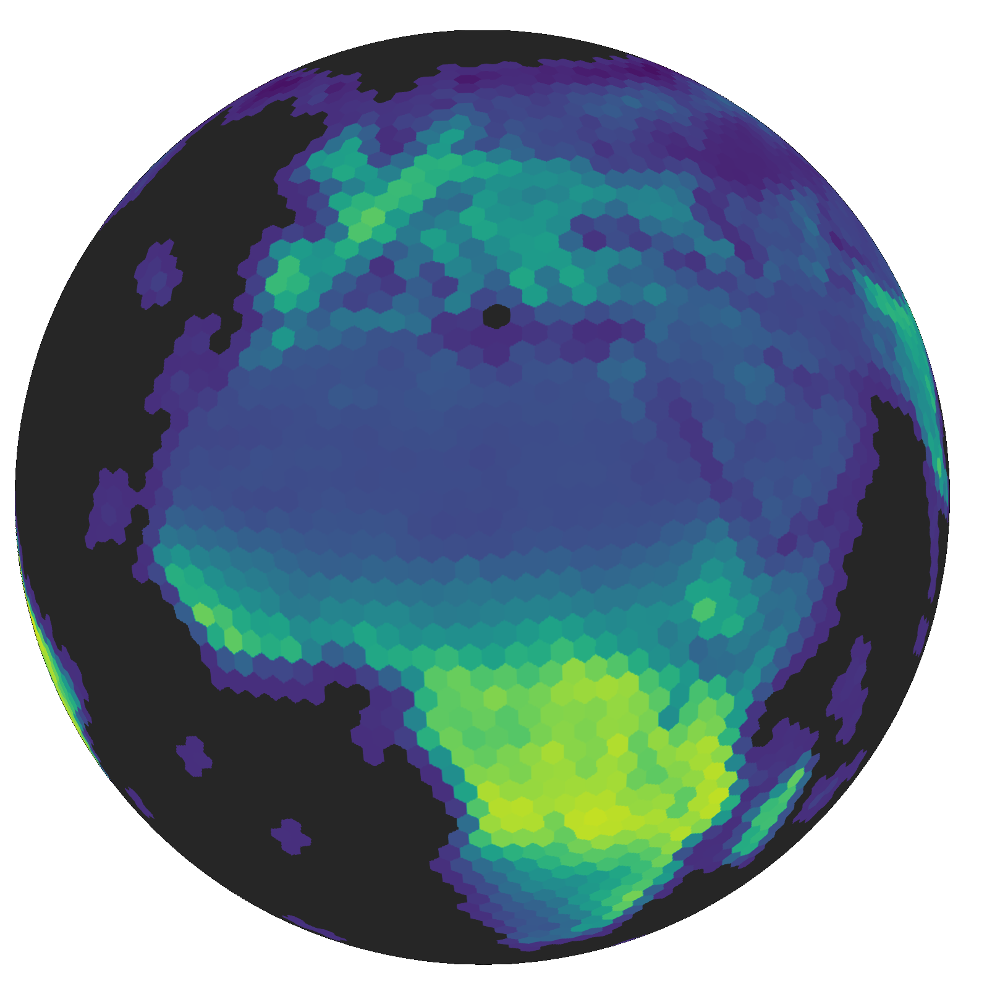

# Background

## Motivation

Satelite imagery involves a projection of the 3D world into 2D images. This introduces spatial distortions, especially near the poles. For example, Greenland appears to be as big as Africa using the Mercator projection. Previous attempts to address this issue, such as employing multiple local projections like the UTM-based Sentinel 2 L1C grid, have led to inefficiencies, including a significant increase in data volume (~30%) due to overlaps that need to be stored, downloaded, and processed. Additionally, there is a lack of a unified global indexing system and the choice of pixel cell shape, which further complicate the analysis. These issues can be mitigated using Discrete Global Grid Systems (DGGS).

## What is a DGGS? {#What-is-a-DGGS?}

A Discrete Global Grid Systems (DGGS) tessellate the surface of the earth with hierarchical cells of equal area. This minimizes distortion and loading time of large geospatial datasets, which is crucial in spatial statistics and building Machine Learning models. Hereby, the globe is approximated using a platonic solid (usually an icosahedron), with local projections for each individual face. Each face is subsequently divided into smaller and smaller cells (usually hexagons, triangles or diamonds) which are similar to pixels in traditional raster images.

Steps top create a DGGS:
1. Take a platonic solid (e.g. icosahedron)
  
2. Blow it up so that it s size fits the radius of the earth
  
3. Chose a rotation of the polyhedron relative to the  (e.g. those used in the [Dymaxion projection](https://en.wikipedia.org/wiki/Dymaxion_map) so that the vertices of the polyhedrons with high distortions are in the oceans)
  
4. Tessellate the faces of the polyhedron (e.g. triangles, diamonds, or hexagons). One must introduce 12 pentagons at the vertices of the polyhedron to enable a tesselation of the 3D surface with hexagons. Polygons are regular on the faces of the polyhedron but may be distorted after re-projection to the sphere.
  
5. Redo the tessellation with increasing resolutions forming a grid system
  

 DGGRID ISEA4H grid at different spatial resolutions

 MODIS NDVI at resolution level 6

# When to use a DGGS {#When-to-use-a-DGGS}
- Integration of data originated from different spatial resolutions (e.g. [Li et al. 2022](https://doi.org/10.3390/ijgi11120627))
  
- Integration of raster and vector data (e.g. [Rawson et al. 2021](https://doi.org/10.1080/20964471.2021.1965370))
  
- Analyses in which each cell must be of the same area
  
- Representing flows of cells to neighbors (e.g. [Uber H3](https://www.uber.com/en-DE/blog/h3/))
  
