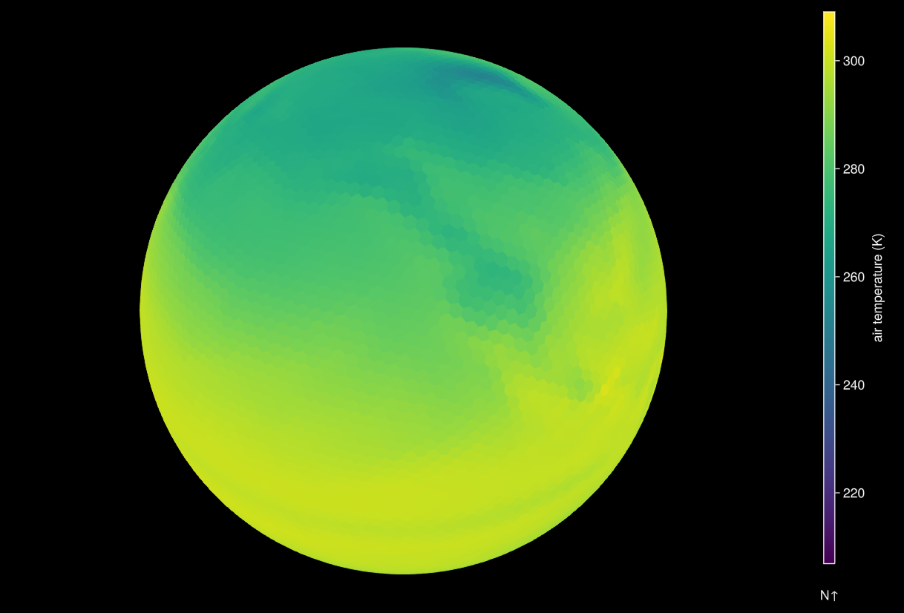

# Get Started {#Get-Started}

## Why DGGS.jl ? {#Why-DGGS.jl-?}

Discrete Global Grid Systems (DGGS) tessellate the surface of the earth with hierarchical cells of equal area, minimizing distortion and loading time of large geospatial datasets, which is crucial in spatial statistics and building Machine Learning models. DGGS native data cubes use coordinate systems other than longitude and latitude to represent the special geometry of the grid needed to reduce the distortions of the individual cells or pixels.

## Installation {#Installation}

::: info Currently, we only develop and test this package on Linux machines with the latest stable release of Julia.

:::

Install the latest version from GitHub:

```julia
using Pkg
Pkg.add(url="https://github.com/danlooo/DGGS.jl.git")
```


## Load a DGGS native data cube {#Load-a-DGGS-native-data-cube}

This dataset is based on the [example](https://www.unidata.ucar.edu/software/netcdf/examples/files.html) from the Community Climate System Model (CCSM), one time step of precipitation flux, air temperature, and eastward wind. 

```julia
using DGGS
p1 = open_dggs_pyramid("https://s3.bgc-jena.mpg.de:9000/dggs/datasets/example-ccsm3")
```


```ansi
DGGSPyramid
DGGS: DGGRID ISEA4H Q2DI ⬢
Levels: [2, 3, 4, 5, 6]
Non spatial axes:
  Ti 1 CFTime.DateTimeNoLeap points
  plev 17 Float64 points
Arrays:
  msk_rgn bool Union{Missing, Bool} 
  tas air_temperature (:Ti) K Union{Missing, Float32} aggregated
  ua eastward_wind (:plev, :Ti) m s-1 Union{Missing, Float32} aggregated
  pr precipitation_flux (:Ti) kg m-2 s-1 Union{Missing, Float32} aggregated
  area meter2 Union{Missing, Float32} 

```


This object contains multiple variables at several spatial resolutions. Let&#39;s select the air temperature at the highest resolution at the first time point:

```julia
a1 = p1[level=6, id=:tas, Time=1]
```


```ansi
DGGSArray{Union{Missing, Float32}, 6}
Name:		tas
Title:		model output prepared for IPCC AR4
Standard name:	air_temperature
Units:		K
DGGS:		DGGRID ISEA4H Q2DI ⬢ at level 6
Attributes:	40
Non spatial axes:

```


Plot the array as a globe:

```julia
using GLMakie
plot(a1)
```





Get one hexagonal cell and all neighboring cells within a radius of `k` at a given geographical coordinate using `a[lon,lat,1:k]`:

```julia
a1[11.586, 50.927, 1:3]
```


```ansi
┌ 19-element YAXArray{Union{Missing, Float32}, 1} ┐
├─────────────────────────────────────────────────┴────── dims ┐
  ↓ q2di_k Sampled{Int64} 1:19 ForwardOrdered Regular Points
├──────────────────────────────────────────── loaded in memory ┤
  data size: 76.0 bytes
└──────────────────────────────────────────────────────────────┘
```


## Create a DGGS native data cube {#Create-a-DGGS-native-data-cube}

Let&#39;s simulate traditional raster data with axes for longitude and latitude:

```julia
using DimensionalData
using YAXArrays

lon_range = X(-180:180)
lat_range = Y(-90:90)
time_range = Ti(1:10)
level = 6
data = [exp(cosd(lon)) + t * (lat / 90) for lon in lon_range, lat in lat_range, t in time_range]
geo_arr = YAXArray((lon_range, lat_range, time_range), data, Dict())
```


```ansi
┌ 361×181×10 YAXArray{Float64, 3} ┐
├─────────────────────────────────┴───────────────────── dims ┐
  ↓ X Sampled{Int64} -180:180 ForwardOrdered Regular Points,
  → Y Sampled{Int64} -90:90 ForwardOrdered Regular Points,
  ↗ Ti Sampled{Int64} 1:10 ForwardOrdered Regular Points
├─────────────────────────────────────────── loaded in memory ┤
  data size: 4.99 MB
└─────────────────────────────────────────────────────────────┘
```


and convert it into a DGGS:

```julia
p2 = to_dggs_pyramid(geo_arr, level; lon_name=:X, lat_name=:Y)
```


```ansi
DGGSPyramid
DGGS: DGGRID ISEA4H Q2DI ⬢
Levels: [2, 3, 4, 5, 6]
Non spatial axes:
  Ti 10 Int64 points
Arrays:
  layer (:Ti)  Union{Missing, Float64} 

```

