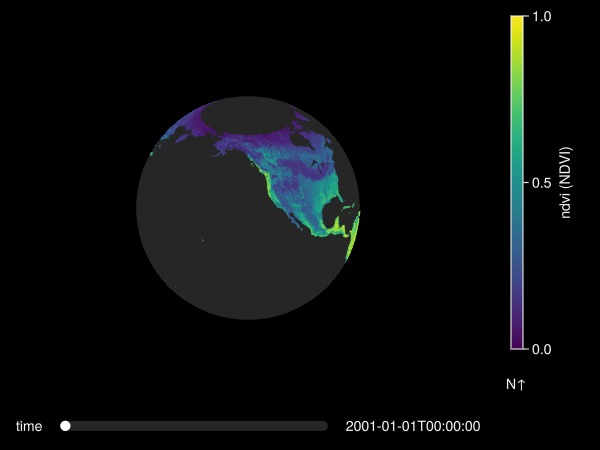
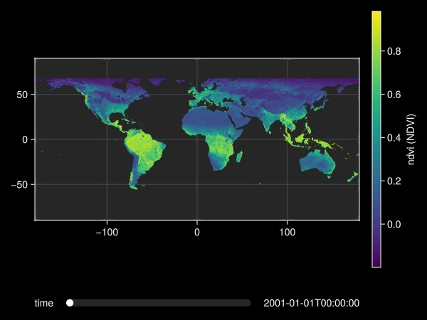

# Plot {#Plot}

```julia
using GLMakie
using DGGS
p = open_dggs_pyramid("https://s3.bgc-jena.mpg.de:9000/dggs/datasets/modis")
a = p[10].ndvi
```


```ansi
DGGSArray{Union{Missing, Float32}, 10}
Name:		ndvi
Units:		NDVI
DGGS:		DGGRID ISEA4H Q2DI ⬢ at level 10
Attributes:	18
Non spatial axes:
  time 216 Dates.DateTime points

```


Plotting is performed on a `DGGSArray` at a given spatial resolution level. Selecting on non-spatial dimensions (e.g. Time) can be done later on in the interactive plot. Image resolution can be adjusted using the `resolution` argument of the `plot` method. Plotting requires to convert the DGGS space back to geographical coordinates. The coordinate transformation is downloaded from a cache server instead of computed if the given resolution is available.

```julia
plot(a)
```



Plot as a map:

```julia
plot(a; type=:map)
```


