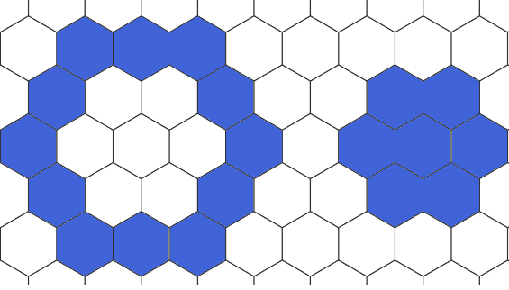

# Select

## Select arrays {#Select-arrays}

Open a array for testing:

```julia
using DGGS
p = open_dggs_pyramid("https://s3.bgc-jena.mpg.de:9000/dggs/datasets/modis")
```


```
DGGSPyramid
DGGS: DGGRID ISEA4H Q2DI ⬢
Levels: [2, 3, 4, 5, 6, 7, 8, 9, 10]
Non spatial axes:
  Ti 216 Dates.DateTime points
Arrays:
  lst (:Ti) K Union{Missing, Float32} 
  ndvi (:Ti) NDVI Union{Missing, Float32} 

```


Select a ndvi at a given spatial resolution level:

```julia
p[5]
```


```
DGGSLayer{5}
DGGS:	DGGRID ISEA4H Q2DI ⬢ at level 5
Non spatial axes:
  Ti 216 Dates.DateTime points
Arrays:
  lst (:Ti) K Union{Missing, Float32} 
  ndvi (:Ti) NDVI Union{Missing, Float32} 

```


Select an array by its id:

```julia
p[5].ndvi
```


```
DGGSArray{Union{Missing, Float32}, 5}
Name:		ndvi
Units:		NDVI
DGGS:		DGGRID ISEA4H Q2DI ⬢ at level 5
Attributes:	8
Non spatial axes:
  Ti 216 Dates.DateTime points

```


Additional filtering by any non-spatial axes e.g. `Time` still results in a `DGGSArray`:

```julia
p[5].ndvi[Time=1]
```


```
DGGSArray{Union{Missing, Float32}, 5}
Name:		NDVI
Units:		NDVI
DGGS:		DGGRID ISEA4H Q2DI ⬢ at level 5
Attributes:	8
Non spatial axes:

```


Further filtering will return a `YAXArray` instead:

```julia
p[5].ndvi[Time=1][q2di_n = 2]
```


```
╭───────────────────────────────────────────╮
│ 16×16 YAXArray{Union{Missing, Float32},2} │
├───────────────────────────────────────────┴───────────── dims ┐
  ↓ q2di_i Sampled{Int64} 0:1:15 ForwardOrdered Regular Points,
  → q2di_j Sampled{Int64} 0:1:15 ForwardOrdered Regular Points
├───────────────────────────────────────────────────────────────┴──── metadata ┐
  Dict{String, Any} with 8 entries:
  "units"         => "NDVI"
  "missing_value" => -9999.0
  "name"          => "NDVI"
  "_DGGS"         => Dict{String, Any}("aperture"=>4, "index"=>"Q2DI", "id"=>"D…
  "add_offset"    => 0.0
  "long_name"     => "monthly NDVI CMG 0.05 Deg Monthly NDVI"
  "scale_factor"  => 0.0001
  "_FillValue"    => -9999.0
├─────────────────────────────────────────────────────────────────── file size ┤ 
  file size: 1.0 KB
└──────────────────────────────────────────────────────────────────────────────┘
```


## Select cells and its neighbors {#Select-cells-and-its-neighbors}

Select a single cell using geographical coordinates (lon, lat):

```julia
a = p[6].ndvi
a[11.586, 50.927]
```


```
╭─────────────────────────────────────────────────╮
│ 216-element YAXArray{Union{Missing, Float32},1} │
├─────────────────────────────────────────────────┴────────────────────── dims ┐
  ↓ Ti Sampled{Dates.DateTime} [2001-01-01T00:00:00, …, 2018-12-01T00:00:00] ForwardOrdered Irregular Points
├──────────────────────────────────────────────────────────────────── metadata ┤
  Dict{String, Any} with 8 entries:
  "units"         => "NDVI"
  "missing_value" => -9999.0
  "name"          => "NDVI"
  "_DGGS"         => Dict{String, Any}("aperture"=>4, "index"=>"Q2DI", "id"=>"D…
  "add_offset"    => 0.0
  "long_name"     => "monthly NDVI CMG 0.05 Deg Monthly NDVI"
  "scale_factor"  => 0.0001
  "_FillValue"    => -9999.0
├─────────────────────────────────────────────────────────────────── file size ┤ 
  file size: 864.0 bytes
└──────────────────────────────────────────────────────────────────────────────┘
```


Select the same cell using DGGS coordinates (n,i,j):

```julia
a[3,2,30]
```


```
╭─────────────────────────────────────────────────╮
│ 216-element YAXArray{Union{Missing, Float32},1} │
├─────────────────────────────────────────────────┴────────────────────── dims ┐
  ↓ Ti Sampled{Dates.DateTime} [2001-01-01T00:00:00, …, 2018-12-01T00:00:00] ForwardOrdered Irregular Points
├──────────────────────────────────────────────────────────────────── metadata ┤
  Dict{String, Any} with 8 entries:
  "units"         => "NDVI"
  "missing_value" => -9999.0
  "name"          => "NDVI"
  "_DGGS"         => Dict{String, Any}("aperture"=>4, "index"=>"Q2DI", "id"=>"D…
  "add_offset"    => 0.0
  "long_name"     => "monthly NDVI CMG 0.05 Deg Monthly NDVI"
  "scale_factor"  => 0.0001
  "_FillValue"    => -9999.0
├─────────────────────────────────────────────────────────────────── file size ┤ 
  file size: 864.0 bytes
└──────────────────────────────────────────────────────────────────────────────┘
```



 A 3-ring and a 2-disk around a center cell

Select a 2-disk containing all neighboring cells that are at least k cells apart including a given center cell:

```julia
a[11.586, 50.927, 1:2]
```


```
╭───────────────────────────────────────────╮
│ 7×216 YAXArray{Union{Missing, Float32},2} │
├───────────────────────────────────────────┴──────────────────────────── dims ┐
  ↓ q2di_k Sampled{Int64} 1:7 ForwardOrdered Regular Points,
  → Ti     Sampled{Dates.DateTime} [2001-01-01T00:00:00, …, 2018-12-01T00:00:00] ForwardOrdered Irregular Points
├──────────────────────────────────────────────────────────────────── metadata ┤
  Dict{String, Any}()
├─────────────────────────────────────────────────────────────────── file size ┤ 
  file size: 5.91 KB
└──────────────────────────────────────────────────────────────────────────────┘
```


This will introduce a new dimension `q2di_k` iterating over all neighbors. The ordering of cells within this dimension is deterministic but not further specified.

Select a 3-ring of cells having the same distance to the center cell:

```julia
a[11.586, 50.927, 3]
```


```
╭────────────────────────────────────────────╮
│ 12×216 YAXArray{Union{Missing, Float32},2} │
├────────────────────────────────────────────┴─────────────────────────── dims ┐
  ↓ q2di_k Sampled{Int64} 1:12 ForwardOrdered Regular Points,
  → Ti     Sampled{Dates.DateTime} [2001-01-01T00:00:00, …, 2018-12-01T00:00:00] ForwardOrdered Irregular Points
├──────────────────────────────────────────────────────────────────── metadata ┤
  Dict{String, Any}()
├─────────────────────────────────────────────────────────────────── file size ┤ 
  file size: 10.12 KB
└──────────────────────────────────────────────────────────────────────────────┘
```


## long and short syntax {#long-and-short-syntax}

Selection on both spatial and non-spatial dimensions can be performed using keyword-based arguments on pyramids, ndvis, and arrays:

```julia
p[id=:ndvi, Time=1, level=5, lon=11.586, lat=50.927]
```


```
╭───────────────────────────────────────────────────╮
│ 0-dimensional YAXArray{Union{Missing, Float32},0} │
├───────────────────────────────────────────────────┴──────────────── metadata ┐
  Dict{String, Any} with 8 entries:
  "units"         => "NDVI"
  "missing_value" => -9999.0
  "name"          => "NDVI"
  "_DGGS"         => Dict{String, Any}("aperture"=>4, "index"=>"Q2DI", "id"=>"D…
  "add_offset"    => 0.0
  "long_name"     => "monthly NDVI CMG 0.05 Deg Monthly NDVI"
  "scale_factor"  => 0.0001
  "_FillValue"    => -9999.0
├─────────────────────────────────────────────────────────────────── file size ┤ 
  file size: 4.0 bytes
└──────────────────────────────────────────────────────────────────────────────┘
```


which is equivalent to:

```julia
p[5].ndvi[Time=1][11.586, 50.927]
```


```
╭───────────────────────────────────────────────────╮
│ 0-dimensional YAXArray{Union{Missing, Float32},0} │
├───────────────────────────────────────────────────┴──────────────── metadata ┐
  Dict{String, Any} with 8 entries:
  "units"         => "NDVI"
  "missing_value" => -9999.0
  "name"          => "NDVI"
  "_DGGS"         => Dict{String, Any}("aperture"=>4, "index"=>"Q2DI", "id"=>"D…
  "add_offset"    => 0.0
  "long_name"     => "monthly NDVI CMG 0.05 Deg Monthly NDVI"
  "scale_factor"  => 0.0001
  "_FillValue"    => -9999.0
├─────────────────────────────────────────────────────────────────── file size ┤ 
  file size: 4.0 bytes
└──────────────────────────────────────────────────────────────────────────────┘
```

