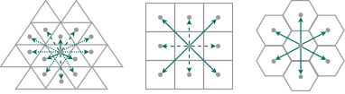

# The background behind Discrete Global Grid Systems (DGGS)

A Discrete Global Grid Systems (DGGS) tessellate the surface of the earth with hierarchical cells of equal area.
This minimizes distortion and loading time of large geospatial datasets, which is crucial in spatial statistics and building Machine Learning models.

## Why to use a DGGS

- multi resolutions
- chunking and compression
- spherical properties
- equal area

## DGGS creation

1. Take a platonic solid (e.g. icosahedron)
2. Blow it up so that it s size fits the radius of the earth
3. Chose a rotation of the polyhedron relative to the  (e.g. those used in the [Dymaxion projection](https://en.wikipedia.org/wiki/Dymaxion_map) so that the evrtices of the polyhedrons with high distortions are in the oceans)
4. Tessellate the faces of the polyhedron (e.g. triangles, diamonds, or hexagons). One must introduce 12 pentagons at the vertices of the polyhedron to enable a tesselation of the 3D surface with hexagons. Polygons are regular on the faces of the polyhedron but may be distorted after re-projection to the sphere.
5. Redo the tessellation with increasing resolutions forming a grid system

By Justin Kunimune - Own work, Public Domain, https://commons.wikimedia.org/w/index.php?curid=65694588

## Projections

- ISEA: Icosahedral Snyder Equal Area projection [Snyder 1992](https://doi.org/10.3138/27H7-8K88-4882-1752). Distortions are low in area but high in shape.
- FULLER: Icosahedral Dymaxion projection of Fuller in 1975. Distortions are moderate in both area and shape. More details at [Gregory et al. 2008](https://doi.org/10.1016/j.compenvurbsys.2007.11.003)

## Grid cells

DGGS cells are optimized towards having equal area leading into an irregular grid in geographical lon/lat space
Any grid, including those used in a DGGS, can be represented as a Voronoi partition of the cell center coordinates
These coordinates are stored in a KD-Tree (Similar in python xarrys extension [Xoak](https://xoak.readthedocs.io/en/latest/index.html))

It is important to give nearby cells a similar cell id.
This allows faster indexing and loading times, because the chunking is based on cell id.
The cell id encodes the 1D (memory address and cell id) curve to traverse the the 2D surface (geographical coordinates).
These space-filling curves are often recursively defined fractals.
Solutions for the 2-D plane are the Hilbert and Gosper curve for rectangular and hexagonal grids, respectively.
The [Superfund grid](https://webpages.sou.edu/~sahrk/docs/superfund_500m_020719.pdf) is a solution for the sphere surface.