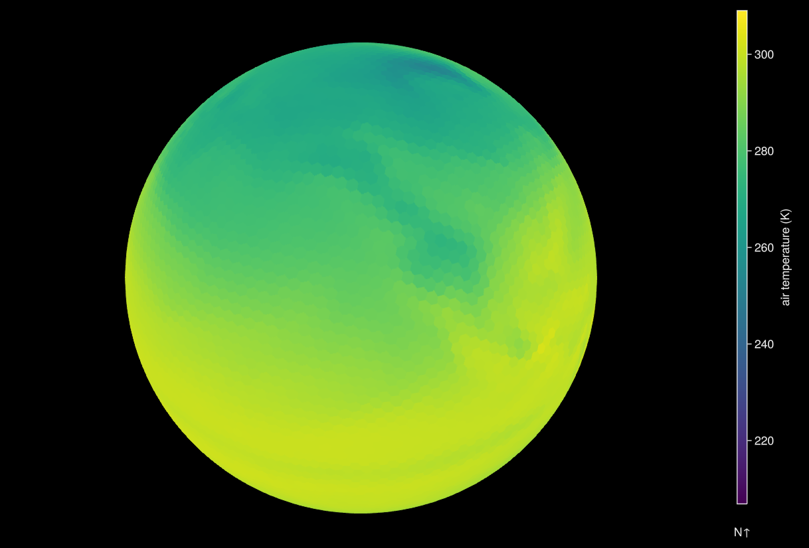

# Get Started

## Why DGGS.jl ?

Discrete Global Grid Systems (DGGS) tessellate the surface of the earth with hierarchical cells of equal area, minimizing distortion and loading time of large geospatial datasets, which is crucial in spatial statistics and building Machine Learning models.
DGGS native data cubes use coordinate systems other than longitude and latitude to represent the special geometry of the grid needed to reduce the distortions of the individual cells or pixels.

## Installation

::: info
Currently, we only develop and test this package on Linux machines with the latest stable release of Julia.

:::

Install the latest version from GitHub:

```julia
using Pkg
Pkg.add(url="https://github.com/danlooo/DGGS.jl.git")
```

## Load a DGGS native data cube

This dataset is based on the [example](https://www.unidata.ucar.edu/software/netcdf/examples/files.html) from the Community Climate System Model (CCSM), one time step of precipitation flux, air temperature, and eastward wind. 

```@example start
using DGGS
p1 = open_dggs_pyramid("https://s3.bgc-jena.mpg.de:9000/dggs/datasets/example-ccsm3")
```

This object contains multiple variables at several spatial resolutions.
Let's select the air temperature at the highest resolution at the first time point:

```@example start
a1 = p1[level=6, id=:tas, Time=1]
```

Plot the array as a globe:

```julia
using GLMakie
plot(a1)
```


Get one hexagonal cell and all neighboring cells within a radius of `k` at a given geographical coordinate using `a[lon,lat,1:k]`:

```@example start
a1[11.586, 50.927, 1:3] 
```

## Create a DGGS native data cube

Let's simulate traditional raster data with axes for longitude and latitude:

```@example start
using DimensionalData
using YAXArrays

lon_range = X(-180:180)
lat_range = Y(-90:90)
time_range = Ti(1:10)
level = 6
data = [exp(cosd(lon)) + t * (lat / 90) for lon in lon_range, lat in lat_range, t in time_range]
geo_arr = YAXArray((lon_range, lat_range, time_range), data, Dict())
```

and convert it into a DGGS:

```@example start
p2 = to_dggs_pyramid(geo_arr, level; lon_name=:X, lat_name=:Y)
```