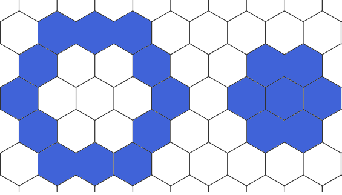

# Select

## Select arrays

Open a array for testing:

```@example select
using DGGS
p = open_dggs_pyramid("https://s3.bgc-jena.mpg.de:9000/dggs/datasets/modis")
```

Select a ndvi at a given spatial resolution level:

```@example select
p[5]
```

Select an array by its id:

```@example select
p[5].ndvi
```

Additional filtering by any non-spatial axes e.g. `Time` still results in a `DGGSArray`:

```@example select
p[5].ndvi[Time=1]
```

Further filtering will return a `YAXArray` instead:

```@example select
p[5].ndvi[Time=1][q2di_n = 2]
```

## Select cells and its neighbors

Select a single cell using geographical coordinates (lon, lat):

```@example select
a = p[6].ndvi
a[11.586, 50.927]
```

Select the same cell using DGGS coordinates (n,i,j):

```@example select
a[3,2,30]
```



A 3-ring and a 2-disk around a center cell

Select a 2-disk containing all neighboring cells that are at least k cells apart including a given center cell:

```@example select
a[11.586, 50.927, 1:2]
```

This will introduce a new dimension `q2di_k` iterating over all neighbors.
The ordering of cells within this dimension is deterministic but not further specified.

Select a 3-ring of cells having the same distance to the center cell:

```@example select
a[11.586, 50.927, 3]
```

## long and short syntax

Selection on both spatial and non-spatial dimensions can be performed using keyword-based arguments on pyramids, ndvis, and arrays:

```@example select
p[id=:ndvi, Time=1, level=5, lon=11.586, lat=50.927]
```

which is equivalent to:

```@example select
p[5].ndvi[Time=1][11.586, 50.927]
```